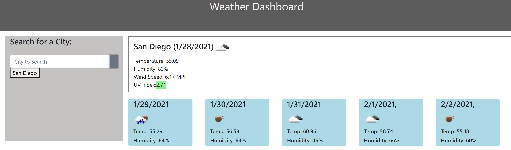

# Weather Monitoring Application
# Weather forecast display application that shows the immediate weather and the five day forecast

Users may want to see an immediate forecast or be able to see future weather so that they can plan and make decisions based on future data. Furthermore, to make planning and visualisation easier, users can do individual searches and quickly access previous searches from the interface with little trouble.

https://alexjalva.github.io/Weather-Monitoring-Application/     

## Installation
 Files can be downloaded at : https://github.com/Alexjalva/Weather-Monitoring-Application.git   

 All files needed are contained within the repository. The main folder needs to include the index.html and style.css. As long as all files are included, and placed in that order, the html should be able to run functions from the script file. 

 ## Usage
 ### How to access the page
Webpage can be loaded based off of html in main repository. index.html holds all of the html and script needed to see and use the website. style.css needs to be in the same folder to correctly see website tools. 

### How to Navigate the Website

Default Start Page - Users accessing the page for the first time will see the weather information for London. There will not be any logged searches yet. They should be able to see the current and five-day forecast for London. Users can see the current weather in the box on the right side of the screen just below the title bar. It will show the weather, the date, and an icon for the forecast. Furthermore the below information indicates the temperature, the humidity, the wind speed in MPH, and the UV index with a corresponding color that shows the danger of the UV index. Below these, users can see the five day forecast split up into five different containers. These show the day of the future forecast, the forecast as an icon, the temperature in fahrenheit, and the humidity percentage just below that. 

#### Performing a Search and Related Website Reactions

First Search - Users can perform a search as seen in this window. They must enter a city into the search bar and then click on the search button the right of the bar. At this time, users will not see any other buttons. 

After the First Search - Users will now see the current and five-day forecast for the city they just searched. The searched city will now be available to display again as a button underneath the search bar. 

#### Continued Use After the First Search

Multiple Searches - Users can make multiple searches after the first search. Every subsequent search should be added as another button below the previous buttons.  

Access Previous Search via Button - Users can click on a button from a previous search to see that data again. As seen in the example, users must simply click the button and the previous data will display again. The new search will not yield a new button.   

#### Returning to the site

Last Search Saved - Upon leaving the website and returning, users should see the weather data for the last city they searched before leaving. This data is stored locally and is dependent on the user continuing to store that data. If users clear their local data, they will not be able to see this. Functionality beyond this will be same as prior. 

## Credits
Original page was created by Alexander Alvarado

## License
MIT License

Copyright (c) 2020 Alexander Alvarado 

Permission is hereby granted, free of charge, to any person obtaining a copy
of this software and associated documentation files (the "Software"), to deal
in the Software without restriction, including without limitation the rights
to use, copy, modify, merge, publish, distribute, sublicense, and/or sell
copies of the Software, and to permit persons to whom the Software is
furnished to do so, subject to the following conditions:

The above copyright notice and this permission notice shall be included in all
copies or substantial portions of the Software.

THE SOFTWARE IS PROVIDED "AS IS", WITHOUT WARRANTY OF ANY KIND, EXPRESS OR
IMPLIED, INCLUDING BUT NOT LIMITED TO THE WARRANTIES OF MERCHANTABILITY,
FITNESS FOR A PARTICULAR PURPOSE AND NONINFRINGEMENT. IN NO EVENT SHALL THE
AUTHORS OR COPYRIGHT HOLDERS BE LIABLE FOR ANY CLAIM, DAMAGES OR OTHER
LIABILITY, WHETHER IN AN ACTION OF CONTRACT, TORT OR OTHERWISE, ARISING FROM,
OUT OF OR IN CONNECTION WITH THE SOFTWARE OR THE USE OR OTHER DEALINGS IN THE
SOFTWARE.
